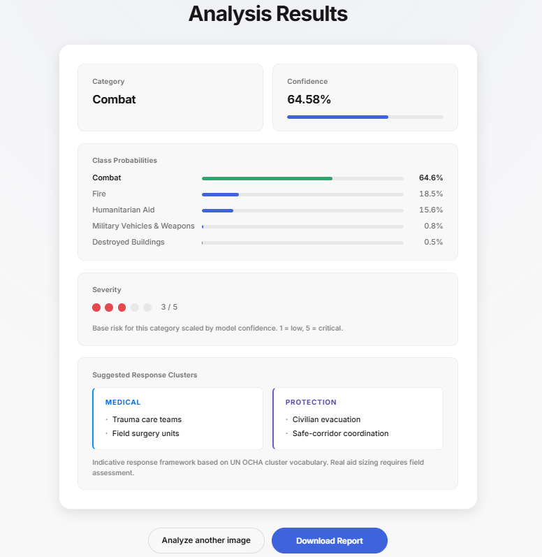

# WarLens

> **Triage for conflict-zone imagery.** Routes the obvious cases to the right humanitarian response cluster, surfaces the ambiguous ones for human review, and shows *why* with a visual attention heatmap.

<!-- The frontend deploys to GitHub Pages on every push to main; the backend lives on a free HF Space. See Deploy below. -->
**Live demo:** [omprxkash.github.io/warlens](https://omprxkash.github.io/warlens)

---

## Why this exists

Aid organisations and conflict journalists routinely process thousands of images a day — from social media, drone overflights, field workers, and partner agencies. Most of that human time goes to *sorting*: is this combat, a fire, civilian aid in progress, or something I can ignore? WarLens does the boring half of that loop so people focus on the hard cases.

For each image it returns:

- a **class** out of five (Combat / Destroyed Buildings / Fire / Humanitarian Aid / Military Vehicles & Weapons)
- a **confidence** score and a 1–5 **severity** rating
- a **suggested response** grouped into UN OCHA-style clusters (Medical, Protection, Shelter, Search & Rescue, Logistics)
- a **Grad-CAM heatmap** showing which pixels drove the prediction, so a human reviewer can decide whether to trust it

If model confidence is below 55%, it refuses to guess and explicitly returns *Uncertain* — the image stays in the human-review pile.

## What this is — and isn't

**It is** a single-image classifier with explainability, packaged as a tiny Flask + React app, trained on a 500-image dataset for the final-year project of four CS undergrads at VIT Chennai. The model architecture, the dataset, and the methodology are real and reproducible.

The front page gives visitors a one-click path to test it: a **Try a sample** strip with one image per trained category that pre-loads into the analyzer with no upload needed.

**It isn't** a deployed drone-feed system, a humanitarian funding tool, or a substitute for field assessment. The severity rating is a model-confidence-scaled heuristic, not a measured impact assessment. The response-cluster vocabulary is borrowed from OCHA so the framing is grounded; the specific suggestions are illustrative.

The full vision (drone ingest, geographic clustering, incident detection, partner integrations) is in the [Roadmap](#roadmap) — this iteration ships the credible foundation.

## Run it locally

You need Python 3.12, Node 22+, and the trained weights at `model/war_lens_resnet50.h5` (and optionally `war_lens_mobilenetv2.h5` for the ensemble).

```bash
make install         # both Python and Node deps

# Two terminals:
make backend         # Flask on :5000
make frontend        # React on :3000 (with REACT_APP_API_URL set to the backend)
```

Docker?

```bash
make docker          # builds both images and brings up the stack
```

Under Docker, the frontend talks to the backend at `/api`, which nginx proxies to the backend container — no CORS, no host-port juggling.

## Deploy

Two-tier, both free, both auto.

### Frontend → GitHub Pages

Pushed-by-default. The workflow at [.github/workflows/deploy-pages.yml](.github/workflows/deploy-pages.yml) builds the React app on every push to `main` with `PUBLIC_URL=/warlens` so assets resolve under the repo subpath, copies `index.html` to `404.html` (the standard SPA-on-Pages fallback so deep links like `/warlens/upload` don't 404), and publishes the build via GitHub's official Pages action.

One-time setup in the repo on GitHub:

1. **Settings → Pages → Source: `GitHub Actions`**
2. **Settings → Secrets and variables → Actions → Variables → New variable:** `WARLENS_API_URL = https://your-user-warlens-api.hf.space` (the URL of your Space; the default in the workflow is a placeholder).
3. Push to `main`. First deploy takes ~2 min. Site goes live at `https://omprxkash.github.io/warlens`.

### Frontend lives under your portfolio without conflict

If you have a personal site at `https://omprxkash.github.io` (the `omprxkash/omprxkash.github.io` repo), this project site at `https://omprxkash.github.io/warlens` lives alongside it independently — they're served from different repos. From the portfolio, link to it with a plain `<a href="/warlens">Try the demo</a>` and you're done. No router config or rewrite rules on the portfolio side.

### Backend → Hugging Face Spaces (Docker SDK)

Free CPU tier. See [huggingface-space/README.md](huggingface-space/README.md) for the deploy steps. The first request after the Space wakes from sleep takes ~30 s — the upload page surfaces a "warming up" hint while it happens.

### Alternative: Vercel

The repo also includes a `vercel.json` if you'd rather deploy the frontend to Vercel (faster cold starts, custom domains easier). Import the GitHub repo at vercel.com and set `REACT_APP_API_URL` in project env vars. Pick one; don't run both.

## How it works under the hood

Both models take a 224×224 RGB image, run it through ImageNet-pretrained convolutional layers (mostly frozen), and learn a new 5-way classification head on top. Standard augmentation — rotation, zoom, shear, horizontal flip — to squeeze more out of the small dataset.

At inference time the backend runs both models, averages their softmax outputs, and picks the top class. If the winning class has <55% confidence, the API returns an *Uncertain* response and skips the Grad-CAM step.

The Grad-CAM heatmap is computed on ResNet50's final convolutional layer (`conv5_block3_out`), upsampled to 224×224, colour-mapped with `COLORMAP_JET`, and blended onto the original image. The result is a base64 PNG returned in the same response and rendered inline on the result page.

## Results

| Model | Accuracy | Precision | Recall | F1 |
|---|---|---|---|---|
| ResNet50 | 92.5% | 91.8% | 92.0% | 91.9% |
| MobileNetV2 | 90.2% | 89.7% | 89.9% | 89.8% |
| Ensemble (mean softmax) | **93.4%** | 92.6% | 92.8% | 92.7% |

Training/validation curves: [docs/figures/](docs/figures/). Architecture diagrams for both networks live there too. Confusion matrices, per-class precision/recall/F1, and a t-SNE of the ResNet feature space are produced by [model/evaluation.ipynb](model/evaluation.ipynb).

<p align="center">
  
</p>

## API reference

`GET /health` — returns whether each model loaded and whether ensemble mode is active.

`POST /upload` — multipart form upload with field name `image`. Returns:

```json
{
  "category": "Combat",
  "confidence": "92.40%",
  "severity_score": 5,
  "response_clusters": [
    { "cluster": "Medical",    "actions": ["Trauma care teams", "Field surgery units"] },
    { "cluster": "Protection", "actions": ["Civilian evacuation", "Safe-corridor coordination"] }
  ],
  "gradcam_image": "<base64 PNG>"
}
```

Low-confidence calls return `category: "Uncertain"` with `confidence`, a human-readable `message`, and `gradcam_image: null`.

## Project layout

```
warlens/
├── backend/             Flask API (app.py), Python deps, Dockerfile
├── frontend/            React app (src, public, package.json, Dockerfile)
├── model/               Training scripts, notebooks, trained weights (.h5, gitignored)
├── dataset/             500 labeled images, organised by class
├── huggingface-space/   Space metadata + Dockerfile for free-tier backend deploy
├── docs/
│   ├── figures/         Architecture diagrams, training curves, screenshots
│   ├── paper/           Conference paper (PDF + LaTeX source)
│   ├── report/          VIT project report and review presentation
│   └── research/        Reference papers and literature survey
├── docker-compose.yml
├── vercel.json
└── Makefile
```

## Roadmap

The project today is a single-image triage demo. The directions below are sketches of what would make it genuinely useful in the field — not commitments, but a roadmap a contributor could pick off.

**Stage 2 — Field intake tool**
- Persist every analysis (SQLite) so the system has a memory across sessions
- A public dashboard with the recent detection feed and per-category counts
- EXIF GPS extraction → pins on a map view
- Batch / folder upload: drop 50 images, get a CSV + a per-class gallery in one screen
- A documented REST API (no auth) for scripts and bots

**Stage 3 — Drone / multi-source ingest**
- A `POST /api/v1/ingest` endpoint with an API key, designed for drone ground stations to push batches of frames
- Spatial-temporal clustering: when N detections of the same class land within K km in T minutes, raise an *incident* with a roll-up severity score scaled by cluster size + confidence
- Outbound webhooks (Slack, email) when a high-severity incident is raised
- Multimodal: pair each image with a caption / tweet, let a vision-language model reason about both

**Open research questions**
- Domain shift: a model trained on news photos will not generalise to drone / satellite / civilian phone footage without retraining
- Trust signals: detecting staged, duplicate, or AI-generated imagery is at least as important as classifying it
- Aid grounding: linking severity to a real framework (OCHA cluster system, Sphere standards) instead of an internal heuristic

## Paper

Full paper PDF: [docs/paper/WarLens – Transfer Learning for Event Classification in Conflict Zones.pdf](docs/paper/WarLens%20%E2%80%93%20Transfer%20Learning%20for%20Event%20Classification%20in%20Conflict%20Zones.pdf)
LaTeX source: [docs/paper/main.tex](docs/paper/main.tex)
Reference literature: [docs/research/](docs/research/)

## License

MIT — see [LICENSE](LICENSE).
