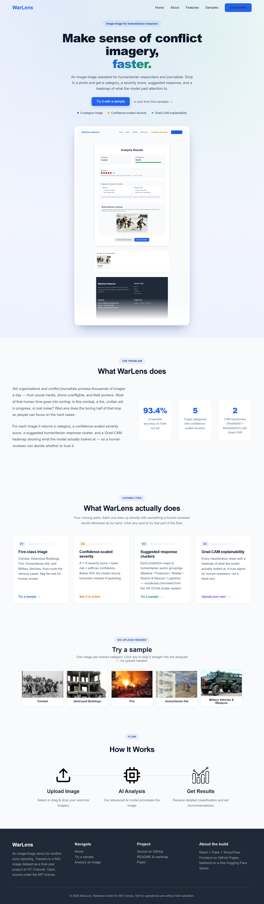
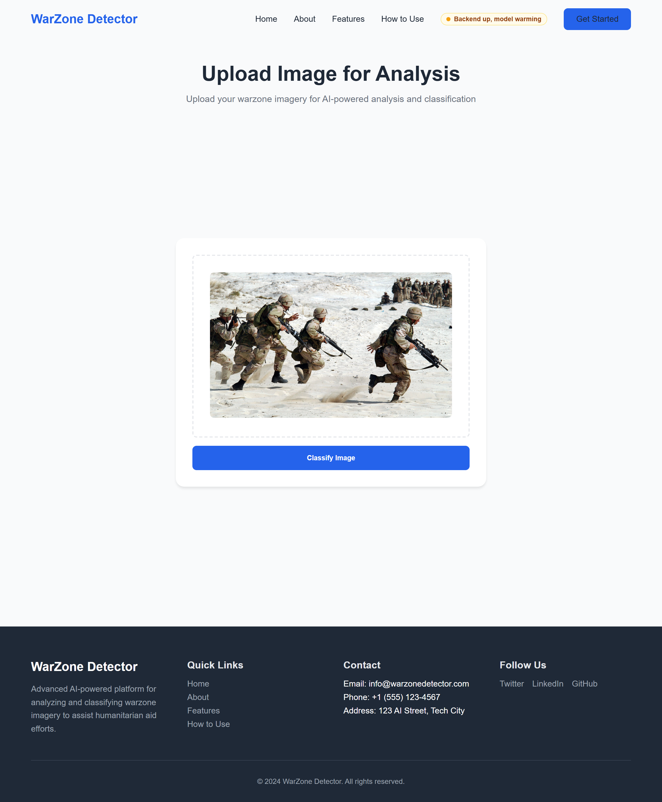
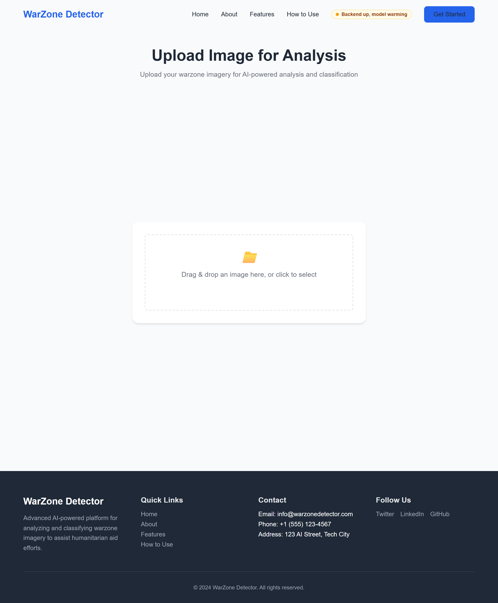
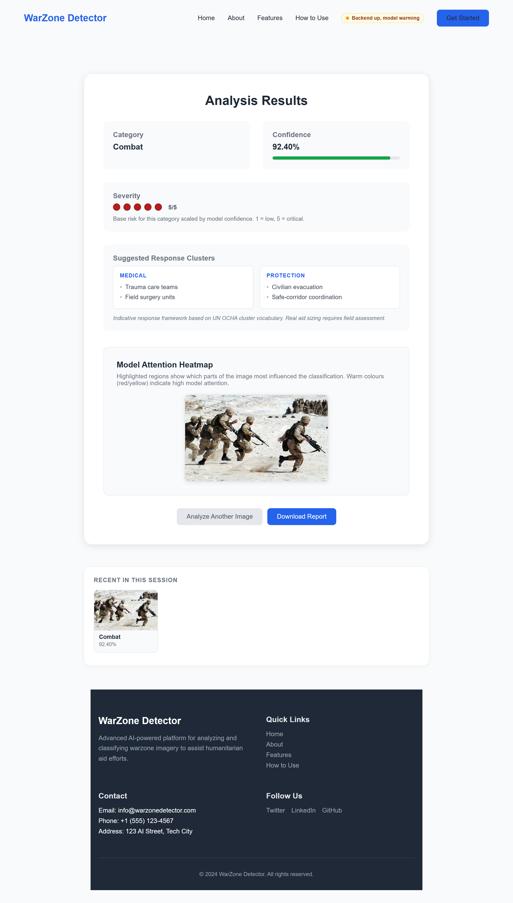

# WarLens UI screenshots

Captured via Playwright against the dev build at viewport 1280×900, deviceScaleFactor 2. Re-generated by running `node scripts/screenshots.js` (or the script in `/tmp/playwright-warlens-screenshots.js`) after any front-end change.

## Home

The landing page — hero, live demo status pill, real-stat About strip, sample-image launcher (one per trained category), and the How-It-Works steps.

## Upload

The analyzer screen with a sample image dropped in, ready for classification.

The empty state on first visit:

## Result

The classification result card — predicted category, confidence bar, 5-dot severity, UN-OCHA-style response clusters, Grad-CAM heatmap, and the session history strip underneath.

---

> Live demo: [omprxkash.github.io/warlens](https://omprxkash.github.io/warlens)
> Project README: [../../../README.md](../../../README.md)
